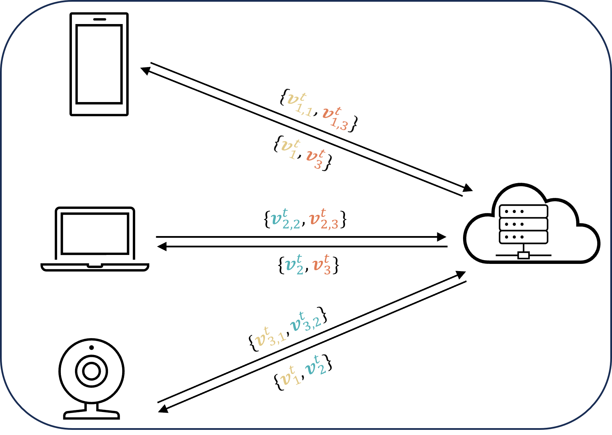
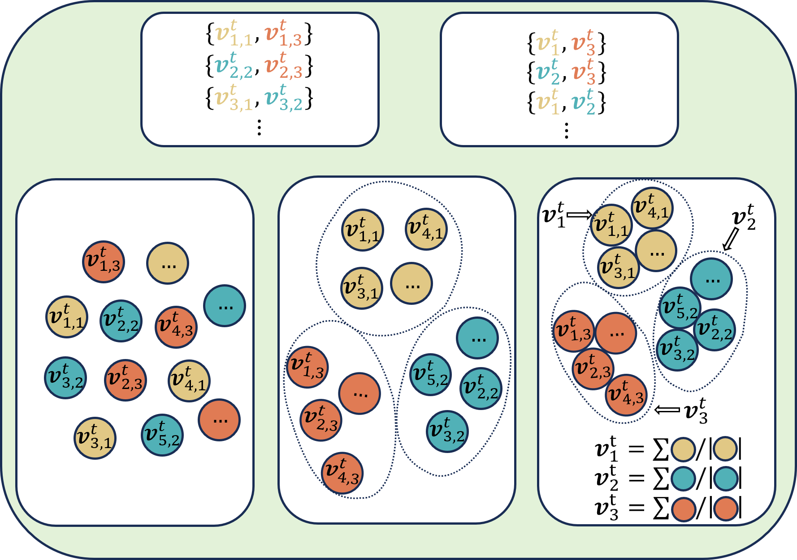
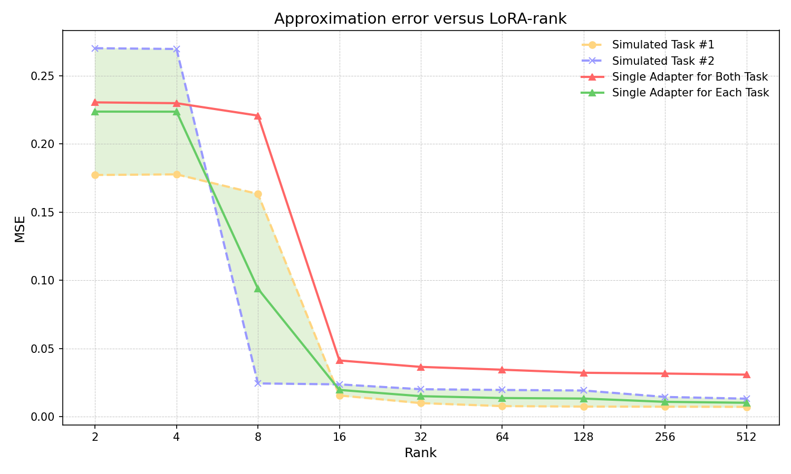
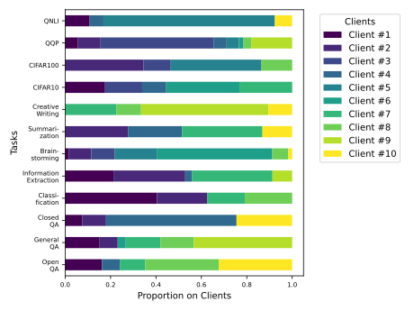
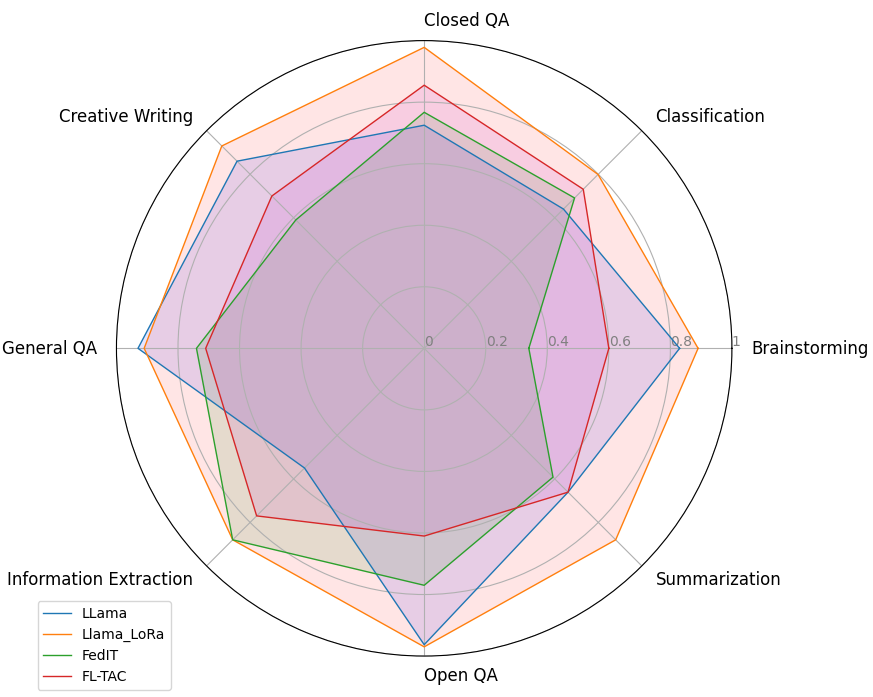
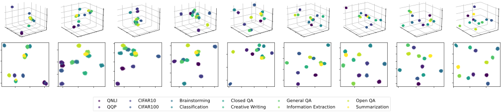

# FL-TAC: Enhanced Fine-Tuning in Federated Learning via Low-Rank, Task-Specific Adapter Clustering

<p align="center"><b>📖 <a href="#fl-tac-enhanced-fine-tuning-in-federated-learning-via-low-rank-task-specific-adapter-clustering">English</a> · <a href="#fl-tac基于低秩任务特定适配器聚类的联邦学习微调方法">中文</a></b></p>

<p align="center">
  <a href="https://arxiv.org/abs/2404.15384"></a>
  <a href="https://llmagents.github.io/"></a>
  <a href="LICENSE"></a>
</p>

Official implementation of **"FL-TAC: Enhanced Fine-Tuning in Federated Learning via Low-Rank, Task-Specific Adapter Clustering"**, accepted at the **ICLR 2024 Workshop on Large Language Model (LLM) Agents**.

📄 **Paper:** [arXiv:2404.15384](https://arxiv.org/abs/2404.15384) &nbsp;·&nbsp; [PDF in this repo](FL-TAC_paper.pdf)

### Authors

**Siqi Ping**<sup>1,†</sup>, **Yuzhu Mao**<sup>1,†</sup>, Yang Liu<sup>2,3</sup>, Xiao-Ping Zhang<sup>1,5</sup>, Wenbo Ding<sup>1,3,4,*</sup>

<sup>1</sup> Tsinghua-Berkeley Shenzhen Institute, Tsinghua Shenzhen International Graduate School, Tsinghua University
<sup>2</sup> Institute for AI Industry Research (AIR), Tsinghua University
<sup>3</sup> Shanghai AI Lab, Shanghai, China
<sup>4</sup> RISC-V International Open Source Laboratory, Shenzhen, China
<sup>5</sup> Department of Electrical, Computer and Biomedical Engineering, Ryerson University

<sup>†</sup> *Equal contribution.* &nbsp;&nbsp; <sup>*</sup> *Corresponding author* (`ding.wenbo@sz.tsinghua.edu.cn`).

---

## Table of Contents

- [Overview](#overview)
- [Experiments](#experiments)
  - [Baselines per scenario](#baselines-per-scenario)
  - [Main results](#main-results-from-the-paper)
- [Repository structure](#repository-structure)
- [Installation](#installation)
- [Datasets](#datasets)
- [Data partition](#data-partition)
- [Reproducing the paper](#reproducing-the-paper)
  - [Scenario 1 — GLUE text classification (BERT)](#scenario-1--glue-text-classification-bert)
  - [Scenario 2 — CIFAR image classification (ViT)](#scenario-2--cifar-image-classification-vit)
  - [Scenario 3 — Databricks-Dolly-15k instruction tuning (LLaMA-7B)](#scenario-3--databricks-dolly-15k-instruction-tuning-llama-7b)
  - [Default hyper-parameters](#default-hyper-parameters)
- [Evaluation](#evaluation)
- [Hardware requirements](#hardware-requirements)
- [Output format](#output-format)
- [Citation](#citation)
- [Acknowledgements](#acknowledgements)

---

## Overview

Fine-tuning large pre-trained models in a Federated Learning (FL) setting is bottlenecked by communication cost. LoRA reduces this cost by transmitting only low-rank adapters, but aggressively shrinking the rank hurts performance — especially when each client must handle **multiple downstream tasks** with diverse data distributions.

**FL-TAC** addresses this by giving each client **one low-rank adapter per local task** instead of a single shared adapter, then clustering similar adapters on the server side and aggregating within each cluster. This recovers strong per-task performance at a *lower* communication budget than the standard FedIT baseline.

<p align="center">
  
  &nbsp;
  
  <br><em>Figure 1. (a) Each client trains one LoRA adapter per local task and uploads them to the server.
  (b) The server runs K-means on the received adapters and performs FedAvg within each cluster, producing N task-specific global adapters.</em>
</p>

<p align="center">
  
  <br><em>Figure 3. Toy simulation: a single shared adapter (red) needs much higher rank than per-task adapters (green) to reach the same approximation error — motivating the per-task design of FL-TAC.</em>
</p>

### Key idea

For each communication round t:

1. **Local fine-tuning** — Each selected client `i` updates one low-rank adapter `v_{i,j}` per local task `j ∈ N_i`, while keeping the pre-trained backbone `θ` frozen.
2. **Server clustering** — The server collects all submitted adapters from all clients across all tasks, flattens them into vectors, and runs **K-means with K = N** (total number of tasks in the system).
3. **Cluster-wise FedAvg** — Adapters within the same cluster are averaged (weighted by sample count) into a new global task-specific adapter `v^t_n`.

The result: each downstream task ends up with its own dedicated global adapter, even though no task labels are transmitted to the server.

---

## Experiments

We evaluate on three scenarios spanning text generation, text classification, and image classification.

| Scenario | Base Model | Datasets | # Tasks |
|---|---|---|---|
| Instruction tuning | LLaMA-7B | Databricks-Dolly-15k | 8 |
| Text classification | BERT-base | GLUE: SST-2, MRPC, QQP, QNLI, RTE | 5 |
| Image classification | ViT-base (ImageNet-21k) | CIFAR-10, CIFAR-100 | 2 |

All scenarios use **10 clients** with a **Dirichlet(α = 0.5)** partition (Hsu et al., 2020) of each task across clients.

<p align="center">
  
  &nbsp;
  
  <br><em>Figure 2. (a) Per-client task data proportions under Dirichlet(α = 0.5).
  (b) Radar chart of FL-TAC vs LLaMA / LLaMA-LoRA / FedIT on the eight Databricks-Dolly-15k tasks.</em>
</p>

### Baselines per scenario

| Scenario | Baselines |
|---|---|
| **Dolly + LLaMA-7B** | LLaMA-7B (no fine-tune) · LLaMA-7B-LoRA (centralized, rank 1) · **FedIT** (FL, LoRA rank 16, single shared adapter) |
| **GLUE + BERT** | BERT (centralized full FT) · BERT-LoRA (centralized) · **FedIT** (FL, single shared adapter) |
| **CIFAR + ViT** | ViT (centralized full FT) · ViT-LoRA (centralized) · **FedIT** (FL, single shared adapter) |

### Main results (from the paper)

**Databricks-Dolly-15k** (GPT-4 scoring):

| Method | Avg. score | Trainable params |
|---|---|---|
| LLaMA-7B (no FT) | 0.770 | 6.6 B |
| LLaMA-7B-LoRA (CL) | **0.905** | 4.26 M |
| FedIT (FL) | 0.671 | 8.52 M |
| **FL-TAC (ours)** | **0.705** | **4.26 M** |

**GLUE (BERT) and Images (ViT)**:

| Method | QNLI | QQP | SST-2 | RTE | MRPC | CIFAR-10 | CIFAR-100 |
|---|---|---|---|---|---|---|---|
| FedIT | 0.670 | 0.510 | 0.652 | 0.524 | 0.520 | 0.935 | 0.854 |
| **FL-TAC** | **0.787** | **0.807** | **0.874** | **0.532** | **0.673** | **0.946** | **0.884** |

FL-TAC also uses **fewer** trainable params than FedIT in both BERT (192 K vs 614 K) and ViT (36.8 K vs 294.9 K) settings.

<p align="center">
  
  <br><em>Figure 4. UMAP visualization of K-means clustering of received adapters at the server, from epoch 1 (left) to epoch 9 (right). Clusters become increasingly separated as training progresses, confirming that LoRA adapters carry strong task identity even without explicit task labels.</em>
</p>

---

## Repository structure

```
FL-TAC/
├── configs/                    # YAML configs, one per scenario
│   ├── glue_bert.yaml
│   ├── cifar_vit.yaml
│   └── dolly_llama.yaml
├── fltac/
│   ├── data.py                 # Dolly / GLUE / CIFAR + Dirichlet partition
│   ├── models.py               # base model + PEFT/LoRA wrapping
│   ├── client.py               # FL client (multi-task local fine-tuning)
│   ├── server.py               # K-means clustering + per-cluster FedAvg
│   ├── trainer.py              # FL training loop (Algorithm 1)
│   └── utils.py                # logging, eval, seeding
├── scripts/
│   ├── run_glue.sh
│   ├── run_cifar.sh
│   └── run_dolly.sh
├── main.py                     # entry point
└── requirements.txt
```

---

## Installation

```bash
git clone https://github.com/<your-username>/FL-TAC.git
cd FL-TAC
python -m venv venv && source venv/bin/activate
pip install -r requirements.txt
```

Tested with Python 3.10, PyTorch 2.1, transformers 4.40, peft 0.10, CUDA 12.4.

---

## Datasets

All datasets are pulled automatically from the HuggingFace Hub on first run; no manual preparation is needed. They will be cached under `./hf_cache/` (override with `cache_dir` in the config).

| Dataset | HuggingFace Hub | Original source |
|---|---|---|
| Databricks-Dolly-15k | [`databricks/databricks-dolly-15k`](https://huggingface.co/datasets/databricks/databricks-dolly-15k) | [databrickslabs/dolly](https://github.com/databrickslabs/dolly) |
| GLUE (SST-2, MRPC, QQP, QNLI, RTE) | [`nyu-mll/glue`](https://huggingface.co/datasets/nyu-mll/glue) | [gluebenchmark.com](https://gluebenchmark.com/) |
| CIFAR-10 | [`uoft-cs/cifar10`](https://huggingface.co/datasets/uoft-cs/cifar10) | [cs.toronto.edu/~kriz/cifar](https://www.cs.toronto.edu/~kriz/cifar.html) |
| CIFAR-100 | [`uoft-cs/cifar100`](https://huggingface.co/datasets/uoft-cs/cifar100) | [cs.toronto.edu/~kriz/cifar](https://www.cs.toronto.edu/~kriz/cifar.html) |

For LLaMA-7B you'll also need [`huggyllama/llama-7b`](https://huggingface.co/huggyllama/llama-7b) (ungated) or [`meta-llama/Llama-2-7b-hf`](https://huggingface.co/meta-llama/Llama-2-7b-hf) (requires HuggingFace token).

> **For users in mainland China**: prepend `export HF_ENDPOINT=https://hf-mirror.com` to use the HuggingFace mirror.

---

## Data partition

All three scenarios use a **per-task Dirichlet(α) split** following Hsu et al., 2020 — the standard non-IID partition for FL benchmarking. For each task independently:

1. Sample a vector `p ~ Dir(α, ..., α)` of length `n_clients` (we use **n_clients = 10**, **α = 0.5**).
2. Zero out any entry below `min_frac = 0.01` and renormalise — this gives some clients zero data for that task, modelling realistic data sparsity.
3. Partition the task's training samples across the 10 clients in those proportions.

A different `seed` is used for each task (`seed + task_index`) so the per-task splits are independent. The implementation is in [`fltac/data.py`](fltac/data.py) (`dirichlet_partition` and `partition_all`).

You can inspect the exact split for any scenario **without downloading anything or loading a model** using the helper script:

```bash
# Default: 10 clients, alpha=0.5, seed=42
python scripts/inspect_partition.py --scenario glue
python scripts/inspect_partition.py --scenario cifar
python scripts/inspect_partition.py --scenario dolly

# Try a more skewed split, save to CSV
python scripts/inspect_partition.py --scenario glue --alpha 0.1 \
    --save partition.csv
```

Example output for `--scenario glue` (default config):

```
=== GLUE partition (n_clients=10, alpha=0.5, min_frac=0.01, seed=42) ===

client      sst2    mrpc     qqp    qnli     rte    total
---------------------------------------------------------
#0          9765       0       0    4435    1029    15229
#1         15540     263   12764   10121      43    38731
#2             0     536       0   11902     245    12683
#3          9174     131    8855    2208     151    20519
#4             0    2164   31032    5540     518    39254
#5          1669      58   13121    8412     379    23639
#6          5443      71  165334   43650       0   214498
#7          3777     175       0   12879      88    16919
#8         12940     270  132740    5596      36   151582
#9          9041       0       0       0       1     9042
---------------------------------------------------------
total      67349    3668  363846  104743    2490   542096
```

The runs that produced our results in this README all use **n_clients = 10, α = 0.5, seed = 42**. Pass `--n_clients`, `--alpha`, `--seed` to the training script (or this inspection script) to try different splits — the partition is fully reproducible from those four inputs.

---

## Reproducing the paper

All three scenarios use the same federated setup: **10 clients, Dirichlet(α = 0.5) data partition** on every task (Hsu et al., 2020), seed = 42, full client participation each round. See [Data partition](#data-partition) above for details.

### Scenario 1 — GLUE text classification (BERT)

| | |
|---|---|
| **Backbone** | `bert-base-uncased` |
| **Datasets** | GLUE: SST-2, MRPC, QQP, QNLI, RTE (5 tasks) |
| **Eval metric** | accuracy on the official GLUE validation split |
| **Hardware** | 1 × GPU with ≥ 8 GB |

```bash
# FL-TAC (ours)
python main.py --config configs/glue_bert.yaml

# FedIT baseline (single shared adapter)
python main.py --config configs/glue_bert.yaml --method fedit \
    --output_dir results/glue_bert_fedit
```

### Scenario 2 — CIFAR image classification (ViT)

| | |
|---|---|
| **Backbone** | `google/vit-base-patch16-224-in21k` |
| **Datasets** | CIFAR-10, CIFAR-100 (2 tasks) |
| **Eval metric** | top-1 accuracy on the official test split |
| **Hardware** | 1 × GPU with ≥ 8 GB |

```bash
# FL-TAC (ours)
python main.py --config configs/cifar_vit.yaml

# FedIT baseline
python main.py --config configs/cifar_vit.yaml --method fedit \
    --output_dir results/cifar_vit_fedit
```

### Scenario 3 — Databricks-Dolly-15k instruction tuning (LLaMA-7B)

| | |
|---|---|
| **Backbone** | `huggyllama/llama-7b` (ungated) — or `meta-llama/Llama-2-7b-hf` (gated) |
| **Dataset** | Databricks-Dolly-15k, split by its 8 task categories |
| **Code metric** | per-task language-modelling cross-entropy loss on a held-out 5 % split |
| **Paper metric** | **GPT-4 scoring** on generated answers (see [Evaluation](#evaluation) below) |
| **Hardware** | 1 × 24 GB GPU minimum, 2–4 × RTX 4090 / 1 × A100 recommended |

```bash
# FL-TAC (ours) — single card
CUDA_VISIBLE_DEVICES=0 python main.py --config configs/dolly_llama.yaml \
    --model_name huggyllama/llama-7b

# FL-TAC (ours) — multi-card via device_map="auto"
CUDA_VISIBLE_DEVICES=0,1,2,3 python main.py --config configs/dolly_llama.yaml \
    --model_name huggyllama/llama-7b

# FedIT baseline
CUDA_VISIBLE_DEVICES=0,1 python main.py --config configs/dolly_llama.yaml \
    --model_name huggyllama/llama-7b --method fedit \
    --output_dir results/dolly_llama_fedit
```

For LLaMA-7B we rely on HuggingFace's `device_map="auto"` to shard the backbone across all visible GPUs. **The same code runs on single-card and multi-card** without changes — just set `CUDA_VISIBLE_DEVICES`.

### Default hyper-parameters

Defined in the YAML configs; can be overridden on the command line via either named flags (`--rounds 30 --lr 1e-4`) or generic `--override key=value`.

| Scenario | LoRA rank | LR | Batch | Local steps | Rounds |
|---|---|---|---|---|---|
| GLUE / BERT | 4 | 5e-4 | 32 | 50 | 20 |
| CIFAR / ViT | 4 | 1e-3 | 64 | 50 | 20 |
| Dolly / LLaMA-7B | 8 | 3e-4 | 4 | 30 | 10 |

All scenarios: 10 clients, Dirichlet α = 0.5, seed = 42.

---

## Evaluation

| Scenario | What `metrics.jsonl` contains | How the paper scores it |
|---|---|---|
| **GLUE** | top-1 **accuracy** per task per eval round | same — accuracy on the GLUE validation split |
| **CIFAR** | top-1 **accuracy** per task per eval round | same — accuracy on the test split |
| **Dolly** | **language-modelling loss** (cross-entropy) per task per eval round | **GPT-4 scoring** on generated answers, using the protocol of [FedIT (Zhang et al., 2023)](https://github.com/JayZhang42/FederatedGPT-Shepherd) |

For GLUE and CIFAR our `metrics.jsonl` numbers are directly comparable to the paper.

For **Dolly**, the paper uses GPT-4 to score the model's generated answers against the reference responses on a 0–1 scale, then averages per category. Our `metrics.jsonl` reports LM loss instead, which is fast to compute and useful for sanity-checking convergence, but is **not** the same metric as the paper's. To exactly reproduce the paper's Dolly numbers you need to:

1. Load the final FL-TAC adapter for each task and `model.generate(...)` answers on the held-out split.
2. Send `(reference, prediction)` pairs to a GPT-4 model with a scoring prompt.
3. Average the returned scores per task.

A starter script is provided at [`scripts/eval_dolly_gpt4.py`](scripts/eval_dolly_gpt4.py) — fill in your `OPENAI_API_KEY` and run after the FL-TAC training has finished.

---

## Hardware requirements

| Scenario | Min GPU | Recommended |
|---|---|---|
| GLUE + BERT | 8 GB | any modern GPU |
| CIFAR + ViT | 8 GB | any modern GPU |
| Dolly + LLaMA-7B | 24 GB (single) | A100 40 GB / 4 × RTX 4090 |

---

## Output format

Each run writes to `<output_dir>/`:

- `metrics.jsonl` — one JSON record per local-step / eval / round-end:
  ```json
  {"round": 3, "phase": "eval", "task": "sst2", "metric": 0.81}
  {"round": 3, "phase": "local", "client": 2, "task": "sst2", "loss": 0.42, "n": 124}
  ```
- `cluster_assignments.jsonl` — K-means cluster id and matched task labels per round, plus clustering accuracy.
- `adapters_round_<t>.pt` — aggregated cluster adapters at round `t`, suitable for offline UMAP visualization (Fig. 4 in the paper).

---

## Citation

```bibtex
@inproceedings{ping2024fltac,
  title     = {FL-TAC: Enhanced Fine-Tuning in Federated Learning via Low-Rank, Task-Specific Adapter Clustering},
  author    = {Ping, Siqi and Mao, Yuzhu and Liu, Yang and Zhang, Xiao-Ping and Ding, Wenbo},
  booktitle = {ICLR 2024 Workshop on Large Language Model (LLM) Agents},
  year      = {2024},
  url       = {https://arxiv.org/abs/2404.15384}
}
```

---

## Acknowledgements

This work was supported by the Shenzhen Key Laboratory of Ubiquitous Data Enabling (ZDSYS20220527171406015), the National Key R&D Program of China under Grant No. 2022ZD0160504, and Meituan.

The federated instruction-tuning baseline is adapted from [FedIT (Zhang et al., 2023)](https://github.com/JayZhang42/FederatedGPT-Shepherd).


---

# FL-TAC:基于低秩任务特定适配器聚类的联邦学习微调方法

论文 **"FL-TAC: Enhanced Fine-Tuning in Federated Learning via Low-Rank, Task-Specific Adapter Clustering"** 的官方代码实现。本工作发表于 **ICLR 2024 大语言模型智能体研讨会(LLM Agents Workshop)**。

📄 **论文:** [arXiv:2404.15384](https://arxiv.org/abs/2404.15384) &nbsp;·&nbsp; [本仓库内 PDF](FL-TAC_paper.pdf)

### 作者

**平思琪**<sup>1,†</sup>, **毛宇柱**<sup>1,†</sup>, 刘洋<sup>2,3</sup>, 张晓平<sup>1,5</sup>, 丁文伯<sup>1,3,4,*</sup>

<sup>1</sup> 清华大学深圳国际研究生院,清华-伯克利深圳学院
<sup>2</sup> 清华大学智能产业研究院(AIR)
<sup>3</sup> 上海人工智能实验室
<sup>4</sup> 深圳市 RISC-V 国际开源实验室
<sup>5</sup> 多伦多都会大学(原瑞尔森大学)电气、计算机与生物医学工程系

<sup>†</sup> *共同第一作者* &nbsp;&nbsp; <sup>*</sup> *通讯作者*(`ding.wenbo@sz.tsinghua.edu.cn`)

---

## 目录

- [简介](#简介)
- [实验](#实验)
  - [各场景对应的 Baseline](#各场景对应的-baseline)
  - [论文主要结果](#论文主要结果)
- [仓库结构](#仓库结构)
- [安装](#安装)
- [数据集](#数据集)
- [数据切分](#数据切分)
- [复现实验](#复现实验)
  - [场景 1 —— GLUE 文本分类(BERT)](#场景-1--glue-文本分类bert)
  - [场景 2 —— CIFAR 图像分类(ViT)](#场景-2--cifar-图像分类vit)
  - [场景 3 —— Databricks-Dolly-15k 指令微调(LLaMA-7B)](#场景-3--databricks-dolly-15k-指令微调llama-7b)
  - [修改超参的两种方式](#修改超参的两种方式)
  - [默认超参](#默认超参)
- [评估说明](#评估说明)
- [硬件需求](#硬件需求)
- [输出格式](#输出格式)
- [引用](#引用)
- [致谢](#致谢)

---

## 简介

在联邦学习(FL)框架下微调大规模预训练模型时,通信开销是主要瓶颈。LoRA 通过仅传输低秩适配器降低了通信代价,但当 rank 被压得过低时模型性能会显著下降——尤其是当**每个客户端持有多种下游任务**且数据分布异构时。

**FL-TAC** 的核心思想:让每个客户端**为本地的每一个任务训练一个独立的低秩 LoRA 适配器**,而不是只用一个共享适配器;服务端收到所有适配器后,通过 K-means 聚类将相似的(隐含同任务的)适配器分到一起,然后在每个簇内做加权 FedAvg 聚合。这样在**比 FedIT 基线更低的通信预算下**,获得了更强的多任务性能。

<p align="center">
  
  &nbsp;
  
  <br><em>图 1. (a) 每个客户端为每一个本地任务训练一个 LoRA 适配器并上传到服务端。
  (b) 服务端对收到的适配器做 K-means 聚类,并在每个簇内做 FedAvg 聚合,得到 N 个全局任务特定适配器。</em>
</p>

<p align="center">
  
  <br><em>图 3. 玩具实验:单个共享适配器(红线)需要远高于"每任务一个适配器"(绿线)的 rank,才能达到相同的近似误差——这就是 FL-TAC 采用每任务适配器设计的动机。</em>
</p>

### 算法流程

每一轮通信 t:

1. **本地微调** —— 选中的客户端 `i` 对其本地的每个任务 `j ∈ N_i` 单独更新一个低秩适配器 `v_{i,j}`,预训练主干 `θ` 全程冻结。
2. **服务端聚类** —— 服务端把所有客户端、所有任务上传的适配器拉平成向量,统一跑一次 **K-means(K = 系统总任务数 N)**。
3. **簇内 FedAvg** —— 同一簇内的适配器按样本数加权平均,得到该簇对应任务的新全局适配器 `v^t_n`。

注意:服务端**不需要任何任务标签**,完全凭适配器自身的几何结构把同任务客户端识别出来。

---

## 实验

我们在三个场景上评估 FL-TAC,分别覆盖文本生成、文本分类、图像分类:

| 场景 | 主干模型 | 数据集 | 任务数 |
|---|---|---|---|
| 指令微调 | LLaMA-7B | Databricks-Dolly-15k | 8 |
| 文本分类 | BERT-base | GLUE: SST-2、MRPC、QQP、QNLI、RTE | 5 |
| 图像分类 | ViT-base(ImageNet-21k 预训练)| CIFAR-10、CIFAR-100 | 2 |

三个场景都使用 **10 个客户端**,每个任务的数据按 **Dirichlet(α = 0.5)** (Hsu et al., 2020)切分到客户端上。

<p align="center">
  
  &nbsp;
  
  <br><em>图 2. (a) Dirichlet(α=0.5) 下各客户端的任务数据占比。
  (b) Databricks-Dolly-15k 八个任务上 FL-TAC 与 LLaMA / LLaMA-LoRA / FedIT 的雷达图对比。</em>
</p>

### 各场景对应的 Baseline

| 场景 | Baselines |
|---|---|
| **Dolly + LLaMA-7B** | LLaMA-7B(无微调) · LLaMA-7B-LoRA(集中式,rank 1) · **FedIT**(联邦,LoRA rank 16,单共享适配器) |
| **GLUE + BERT** | BERT(集中式全参微调)· BERT-LoRA(集中式)· **FedIT**(联邦,单共享适配器) |
| **CIFAR + ViT** | ViT(集中式全参微调)· ViT-LoRA(集中式)· **FedIT**(联邦,单共享适配器) |

### 论文主要结果

**Databricks-Dolly-15k**(由 GPT-4 评分):

| 方法 | 平均分 | 可训练参数量 |
|---|---|---|
| LLaMA-7B(无微调) | 0.770 | 6.6 B |
| LLaMA-7B-LoRA(集中式) | **0.905** | 4.26 M |
| FedIT(联邦) | 0.671 | 8.52 M |
| **FL-TAC(本文)** | **0.705** | **4.26 M** |

**GLUE(BERT)与图像分类(ViT)**:

| 方法 | QNLI | QQP | SST-2 | RTE | MRPC | CIFAR-10 | CIFAR-100 |
|---|---|---|---|---|---|---|---|
| FedIT | 0.670 | 0.510 | 0.652 | 0.524 | 0.520 | 0.935 | 0.854 |
| **FL-TAC** | **0.787** | **0.807** | **0.874** | **0.532** | **0.673** | **0.946** | **0.884** |

在 BERT(192 K vs 614 K)和 ViT(36.8 K vs 294.9 K)两个场景下,FL-TAC 的可训练参数量也都**少于** FedIT。

<p align="center">
  
  <br><em>图 4. 服务端 K-means 聚类结果的 UMAP 降维可视化,从 epoch 1(最左)到 epoch 9(最右)。可以清晰看到随着训练推进,不同任务的 adapter 在表示空间中越来越分得开,即使没有任何任务标签的监督。</em>
</p>

---

## 仓库结构

```
FL-TAC/
├── configs/                    # 每个场景一份 YAML 配置
│   ├── glue_bert.yaml
│   ├── cifar_vit.yaml
│   └── dolly_llama.yaml
├── fltac/
│   ├── data.py                 # Dolly / GLUE / CIFAR 加载 + Dirichlet 切分
│   ├── models.py               # 主干模型 + PEFT/LoRA 包装
│   ├── client.py               # 联邦客户端(多任务本地微调)
│   ├── server.py               # K-means 聚类 + 簇内 FedAvg
│   ├── trainer.py              # 联邦训练主循环(算法 1)
│   └── utils.py                # 日志、评估、随机种子
├── scripts/
│   ├── run_glue.sh
│   ├── run_cifar.sh
│   └── run_dolly.sh
├── main.py                     # 入口
└── requirements.txt
```

---

## 安装

```bash
git clone https://github.com/siqi2000/FL-TAC.git
cd FL-TAC
python -m venv venv && source venv/bin/activate
pip install -r requirements.txt
```

测试环境:Python 3.10、PyTorch 2.1、transformers 4.40、peft 0.10、CUDA 12.4。

---

## 数据集

所有数据集都会在第一次运行时自动从 HuggingFace Hub 下载,**不需要手动准备**,默认缓存到 `./hf_cache/`(可通过 config 里的 `cache_dir` 修改)。

| 数据集 | HuggingFace Hub | 原始来源 |
|---|---|---|
| Databricks-Dolly-15k | [`databricks/databricks-dolly-15k`](https://huggingface.co/datasets/databricks/databricks-dolly-15k) | [databrickslabs/dolly](https://github.com/databrickslabs/dolly) |
| GLUE(SST-2、MRPC、QQP、QNLI、RTE)| [`nyu-mll/glue`](https://huggingface.co/datasets/nyu-mll/glue) | [gluebenchmark.com](https://gluebenchmark.com/) |
| CIFAR-10 | [`uoft-cs/cifar10`](https://huggingface.co/datasets/uoft-cs/cifar10) | [cs.toronto.edu/~kriz/cifar](https://www.cs.toronto.edu/~kriz/cifar.html) |
| CIFAR-100 | [`uoft-cs/cifar100`](https://huggingface.co/datasets/uoft-cs/cifar100) | [cs.toronto.edu/~kriz/cifar](https://www.cs.toronto.edu/~kriz/cifar.html) |

LLaMA-7B 主干可以使用 [`huggyllama/llama-7b`](https://huggingface.co/huggyllama/llama-7b)(无需授权)或 [`meta-llama/Llama-2-7b-hf`](https://huggingface.co/meta-llama/Llama-2-7b-hf)(需要 HuggingFace token)。

> 国内用户可以加上 `export HF_ENDPOINT=https://hf-mirror.com` 走镜像。

---

## 数据切分

三个场景统一使用 **逐任务 Dirichlet(α) 切分** —— 这是 FL benchmark 里最常用的非 IID 切分方式(Hsu et al., 2020)。对每一个任务独立做以下操作:

1. 采样一个长度为 `n_clients` 的向量 `p ~ Dir(α, ..., α)`(我们用 **n_clients = 10**,**α = 0.5**)。
2. 把小于 `min_frac = 0.01` 的分量置零并重新归一化 —— 这样部分 client 在某个任务上会**完全没有数据**,更贴近真实的稀疏分布。
3. 按这些比例把该任务的训练集切分到 10 个 client 上。

每个任务使用不同的 seed(`seed + 任务下标`),保证不同任务的切分相互独立。具体实现见 [`fltac/data.py`](fltac/data.py) 中的 `dirichlet_partition` 和 `partition_all`。

我们还提供了一个**完全无需下载数据集、不需要加载模型**的轻量级脚本,可以快速查看任意场景的切分结果:

```bash
# 默认配置:10 个 client、alpha=0.5、seed=42
python scripts/inspect_partition.py --scenario glue
python scripts/inspect_partition.py --scenario cifar
python scripts/inspect_partition.py --scenario dolly

# 试一个更偏斜的切分,并保存为 CSV
python scripts/inspect_partition.py --scenario glue --alpha 0.1 \
    --save partition.csv
```

`--scenario glue` 默认配置下的输出示例:

```
=== GLUE partition (n_clients=10, alpha=0.5, min_frac=0.01, seed=42) ===

client      sst2    mrpc     qqp    qnli     rte    total
---------------------------------------------------------
#0          9765       0       0    4435    1029    15229
#1         15540     263   12764   10121      43    38731
#2             0     536       0   11902     245    12683
#3          9174     131    8855    2208     151    20519
#4             0    2164   31032    5540     518    39254
#5          1669      58   13121    8412     379    23639
#6          5443      71  165334   43650       0   214498
#7          3777     175       0   12879      88    16919
#8         12940     270  132740    5596      36   151582
#9          9041       0       0       0       1     9042
---------------------------------------------------------
total      67349    3668  363846  104743    2490   542096
```

本 README 里所有报告的实验结果统一使用 **n_clients = 10、α = 0.5、seed = 42**。把 `--n_clients`、`--alpha`、`--seed` 传给训练脚本(或这个 inspect 脚本)就可以尝试别的切分 —— 给定这四个输入,切分是完全可复现的。

---

## 复现实验

三个场景统一使用相同的联邦设置:**10 个客户端,所有任务的数据都按 Dirichlet(α = 0.5)** (Hsu et al., 2020)切分到客户端,seed = 42,每轮全员参与。具体细节见上面的 [数据切分](#数据切分) 章节。

### 场景 1 —— GLUE 文本分类(BERT)

| | |
|---|---|
| **主干** | `bert-base-uncased` |
| **数据集** | GLUE:SST-2、MRPC、QQP、QNLI、RTE(共 5 个任务)|
| **评估指标** | GLUE 官方 validation split 上的 accuracy |
| **硬件** | 单卡 ≥ 8 GB 显存即可 |

```bash
# FL-TAC(本文方法)
python main.py --config configs/glue_bert.yaml

# FedIT 基线(单共享 adapter)
python main.py --config configs/glue_bert.yaml --method fedit \
    --output_dir results/glue_bert_fedit
```

### 场景 2 —— CIFAR 图像分类(ViT)

| | |
|---|---|
| **主干** | `google/vit-base-patch16-224-in21k` |
| **数据集** | CIFAR-10、CIFAR-100(共 2 个任务)|
| **评估指标** | 官方 test split 上的 top-1 accuracy |
| **硬件** | 单卡 ≥ 8 GB 显存即可 |

```bash
# FL-TAC(本文方法)
python main.py --config configs/cifar_vit.yaml

# FedIT 基线
python main.py --config configs/cifar_vit.yaml --method fedit \
    --output_dir results/cifar_vit_fedit
```

### 场景 3 —— Databricks-Dolly-15k 指令微调(LLaMA-7B)

| | |
|---|---|
| **主干** | `huggyllama/llama-7b`(无授权) 或 `meta-llama/Llama-2-7b-hf`(需授权) |
| **数据集** | Databricks-Dolly-15k,按其 8 个任务类别(category)切分 |
| **代码默认指标** | 留出 5% 验证集上的逐任务语言模型交叉熵 loss |
| **论文使用指标** | **GPT-4 评分**(详见下方[评估说明](#评估说明)) |
| **硬件** | 最低单卡 24 GB,推荐 2–4 × RTX 4090 / 1 × A100 |

```bash
# FL-TAC(本文方法)—— 单卡
CUDA_VISIBLE_DEVICES=0 python main.py --config configs/dolly_llama.yaml \
    --model_name huggyllama/llama-7b

# FL-TAC(本文方法)—— 多卡(device_map="auto" 自动切分)
CUDA_VISIBLE_DEVICES=0,1,2,3 python main.py --config configs/dolly_llama.yaml \
    --model_name huggyllama/llama-7b

# FedIT 基线
CUDA_VISIBLE_DEVICES=0,1 python main.py --config configs/dolly_llama.yaml \
    --model_name huggyllama/llama-7b --method fedit \
    --output_dir results/dolly_llama_fedit
```

LLaMA-7B 使用 HuggingFace 的 `device_map="auto"` 自动切分到所有可见 GPU,**同一份代码既能跑单卡也能跑多卡**,无需修改任何代码,只用 `CUDA_VISIBLE_DEVICES` 控制即可。

### 修改超参的两种方式

```bash
# 1) 显式命名参数(覆盖最常用的字段)
python main.py --config configs/glue_bert.yaml \
    --rounds 30 --n_clients 8 --lr 1e-4 --lora_rank 8 \
    --method fltac --output_dir results/my_run

# 2) 通用 --override(覆盖任意字段)
python main.py --config configs/glue_bert.yaml \
    --override max_eval_batches=10 dirichlet_alpha=0.3
```

### 默认超参

| 场景 | LoRA rank | 学习率 | Batch | 本地步数 | 通信轮数 |
|---|---|---|---|---|---|
| GLUE / BERT | 4 | 5e-4 | 32 | 50 | 20 |
| CIFAR / ViT | 4 | 1e-3 | 64 | 50 | 20 |
| Dolly / LLaMA-7B | 8 | 3e-4 | 4 | 30 | 10 |

三个场景统一:10 个客户端,Dirichlet α = 0.5,seed = 42。

---

## 评估说明

| 场景 | `metrics.jsonl` 里记录的指标 | 论文里使用的指标 |
|---|---|---|
| **GLUE** | 每个任务每个评估轮的 top-1 **accuracy** | 同左 — GLUE validation split 上的 accuracy |
| **CIFAR** | 每个任务每个评估轮的 top-1 **accuracy** | 同左 — test split 上的 accuracy |
| **Dolly** | 每个任务每个评估轮的**语言模型交叉熵 loss** | **GPT-4 评分**:沿用 [FedIT (Zhang et al., 2023)](https://github.com/JayZhang42/FederatedGPT-Shepherd) 的协议 |

GLUE 和 CIFAR 两个场景下,我们 `metrics.jsonl` 输出的数值可以直接和论文表里的数字对比。

**Dolly** 场景下,论文是用 GPT-4 给模型生成的回答打 0–1 分(对照 reference 回答),然后按任务类别求均值。我们代码默认输出的是 LM loss,这个指标计算快、可以用来观察收敛趋势,但**和论文里的 GPT-4 评分不是同一个量**。要严格复现论文的 Dolly 表格数字,需要:

1. 加载训练好的 FL-TAC 任务 adapter,用 `model.generate(...)` 在留出集上生成回答。
2. 把 `(reference, prediction)` 配对发给 GPT-4,使用一个评分提示词。
3. 按任务类别取平均。

我们提供了一个起步脚本 [`scripts/eval_dolly_gpt4.py`](scripts/eval_dolly_gpt4.py) — 填入你的 `OPENAI_API_KEY`,在 FL-TAC 训练结束后运行即可。

---

## 硬件需求

| 场景 | 最低 GPU | 推荐 |
|---|---|---|
| GLUE + BERT | 8 GB | 任意现代 GPU |
| CIFAR + ViT | 8 GB | 任意现代 GPU |
| Dolly + LLaMA-7B | 单卡 24 GB | A100 40GB / 4 × RTX 4090 |

---

## 输出格式

每次运行会在 `<output_dir>/` 下写入:

- `metrics.jsonl` —— 每行一条 JSON 记录(本地训练 loss / 评估指标 / 每轮总耗时):
  ```json
  {"round": 3, "phase": "eval", "task": "sst2", "metric": 0.81}
  {"round": 3, "phase": "local", "client": 2, "task": "sst2", "loss": 0.42, "n": 124}
  ```
- `cluster_assignments.jsonl` —— 每轮 K-means 的聚类结果、真实任务标签、聚类准确率。
- `adapters_round_<t>.pt` —— 第 `t` 轮聚合后的所有簇适配器,可用于离线 UMAP 可视化(论文图 4)。

这种格式可以直接用 pandas `read_json(..., lines=True)` 读出来画图。

---

## 引用

```bibtex
@inproceedings{ping2024fltac,
  title     = {FL-TAC: Enhanced Fine-Tuning in Federated Learning via Low-Rank, Task-Specific Adapter Clustering},
  author    = {Ping, Siqi and Mao, Yuzhu and Liu, Yang and Zhang, Xiao-Ping and Ding, Wenbo},
  booktitle = {ICLR 2024 Workshop on Large Language Model (LLM) Agents},
  year      = {2024},
  url       = {https://arxiv.org/abs/2404.15384}
}
```

---

## 致谢

本工作受到深圳市泛在数据使能重点实验室(ZDSYS20220527171406015)、国家重点研发计划项目(No. 2022ZD0160504)和美团的资助。

联邦指令微调基线参考了 [FedIT (Zhang et al., 2023)](https://github.com/JayZhang42/FederatedGPT-Shepherd)。
